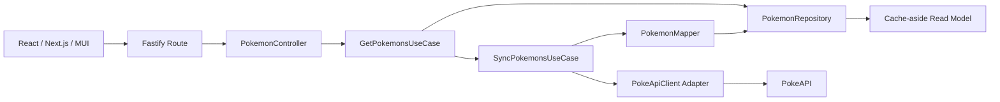

# Pokémon Atlas

A production-quality Pokémon take-home project built as a TypeScript monorepo with a Fastify backend, a Next.js + MUI frontend, Docker local development, and AWS/Terraform deployment coverage.

The backend returns all available Pokémon from PokeAPI through a single endpoint, caches the normalized read model, and exposes only the data the frontend needs.

## Assignment Requirements Covered

- A backend endpoint at `GET /pokemons` that returns a plain array.
- A `GET /health` endpoint for basic readiness checks.
- Backend fetches all available Pokémon using PokeAPI dynamically, without hardcoding the total count.
- Each Pokémon response includes only `name`, `types`, and `image`.
- Frontend consumes only the backend endpoint and never calls PokeAPI directly.
- The full app runs locally.
- The backend is written with Node.js, TypeScript, and Fastify.
- The frontend is written with React, Next.js, TypeScript, and MUI.
- Docker is included for local development.
- Linting and tests are included.
- AWS deployment coverage is included for the backend.
- Terraform infrastructure is included.
- Vercel deployment coverage is included for the frontend.
- A professional README and a DEMO guide are included.

## Bonus Requirements Covered

| Requirement | Implementation |
| --- | --- |
| Lint and tests | ESLint, Prettier, Vitest, React Testing Library |
| Docker local setup | Dockerfiles and docker-compose.yml |
| Next.js | Frontend app built with Next.js |
| AWS | Backend deployment with ECS Fargate, ECR, ALB, CloudFront, CloudWatch |
| Terraform | AWS infrastructure under infra/terraform |
| Vercel | Frontend deployment instructions and environment variable setup |

## Tech Stack

- Backend: Node.js, TypeScript, Fastify, native `fetch`, Vitest
- Frontend: React, Next.js, TypeScript, MUI, React Testing Library
- Infrastructure: Docker, AWS, Terraform
- Quality: ESLint, Prettier

## Architecture Overview

This is a modular monolith with a Backend-for-Frontend orientation and hexagonal boundaries.



## Why This Is Not a Basic Controller-to-PokeAPI Implementation

The route does not know about PokeAPI, list pagination, retries, caching, or normalization. It delegates to a controller, which delegates to a use case. The use case depends on a repository contract and a sync use case. The PokeAPI adapter, retry logic, concurrency control, and caching live in infrastructure, which keeps the system easier to test and safer to modify.

## Architecture Notes

### Modular Monolith

The backend is one deployable application, but the code is split into modules with clear boundaries. That keeps operational complexity low while preserving structure.

### Backend-for-Frontend

The frontend talks only to the backend endpoint that serves the UI needs. The backend shapes the response for the client instead of exposing raw PokeAPI data.

### Hexagonal Architecture

The use cases depend on contracts, not concrete infrastructure. PokeAPI, caching, logging, and HTTP handling are adapters around the core application logic.

### Cache-aside Strategy

`GET /pokemons` first checks the cached read model. If the cache is warm, it returns immediately. If the cache is empty or expired, the backend refreshes the data from PokeAPI, stores it, and returns the normalized result.

### CQRS-lite Read / Sync Separation

The read path is the API request. The sync path is a separate use case and background job that refreshes the cache. That gives a simple CQRS-style split without introducing microservices.

### Architecture Decision: Why not event-driven?

For this take-home project, I intentionally avoided implementing an event bus or queue abstraction in the main codebase. Since the application has one external provider and one primary read endpoint, adding event-driven infrastructure would increase complexity without providing much value for the assignment. Instead, the project uses a pragmatic CQRS-lite design: the read flow serves data from a cache/read model, while the sync flow refreshes that data through a dedicated use case and a background startup job. This keeps the architecture senior-level, testable, and production-aware without overengineering.

A future production version could evolve the sync flow into a true event-driven architecture using EventBridge, SQS, a Lambda worker, and DynamoDB or Redis as the read model. This was intentionally left as a future improvement to keep the take-home implementation focused and maintainable.

## Folder Structure

```text
pokemon-app/
	apps/
		api/
			src/
				main.ts
				server.ts
				modules/pokemon/...
				shared/...
			package.json
		web/
			src/app/...
			src/features/pokemon/...
			package.json
	infra/terraform/...
	docker-compose.yml
	package.json
	README.md
	DEMO.md
```

## Backend Endpoints

### `GET /health`

Returns:

```json
{ "status": "ok" }
```

### `GET /pokemons`

Returns a plain array in the required shape:

```json
[
	{
		"name": "charizard",
		"types": ["fire", "flying"],
		"image": "https://..."
	}
]
```

Important details:

- The response is a plain array.
- The backend returns all available Pokémon in one API call to the frontend.
- The backend uses PokeAPI internally.
- The frontend never calls PokeAPI directly.

## Frontend Features

- App title and short description
- Responsive Pokémon grid
- Pokémon cards with image, name, and type chips
- Search by name
- Filter by type
- Visible and loaded counters
- Clear filters button
- Loading skeletons
- Error state with retry button
- Empty state
- Mobile, tablet, and desktop responsiveness

## How to Run Locally

1. Install dependencies.
2. Copy the example environment files.
3. Start the backend and frontend.

```bash
npm run install:all
npm run dev
```

Or run each app separately:

```bash
npm run dev:api
npm run dev:web
```

## How to Run with Docker

```bash
npm run docker:up
```

Local URLs:

- Frontend: http://localhost:3000
- Backend health: http://localhost:4000/health
- Backend Pokémon endpoint: http://localhost:4000/pokemons

## How to Run Tests

```bash
npm run test
```

## How to Run Linting

```bash
npm run lint
```

## How to Format Code

```bash
npm run format
```

## Environment Variables

### API

```bash
PORT=4000
NODE_ENV=development
POKEAPI_BASE_URL=https://pokeapi.co/api/v2
CACHE_TTL_SECONDS=3600
ALLOWED_CORS_ORIGINS=http://localhost:3000
```

### Web

```bash
NEXT_PUBLIC_API_BASE_URL=http://localhost:4000
```

## Error Handling Strategy

The backend uses a centralized error handler with safe error messages and HTTP status codes. If PokeAPI fails completely and there is no cache, the backend returns a controlled `502`. If the cache exists and a background sync fails, the API keeps serving the cached data.

## Caching Strategy

The repository layer acts as the read model and enforces cache expiration. The use case checks the cache first, then refreshes when needed. That makes the read path fast while keeping the refresh path isolated.

## Retry and Concurrency Strategy

The backend does not fetch Pokémon details sequentially. It uses a concurrency-limited mapper and retry logic for transient HTTP failures. Failed detail requests are logged, and the backend prefers returning the most complete dataset possible.

## AWS Deployment Instructions

The backend is containerized and designed for ECS Fargate behind an ALB. Follow these steps to deploy:

### 1. Build and Push Docker Image to ECR

```bash
# Login to AWS ECR
aws ecr get-login-password --region <AWS_REGION> | docker login --username AWS --password-stdin <ACCOUNT_ID>.dkr.ecr.<AWS_REGION>.amazonaws.com

# Build the backend Docker image
docker build -t pokemon-app-api:latest apps/api

# Create ECR repository (if not already created by Terraform)
aws ecr create-repository --repository-name pokemon-app-api --region <AWS_REGION>

# Tag the image with ECR URI
docker tag pokemon-app-api:latest <ACCOUNT_ID>.dkr.ecr.<AWS_REGION>.amazonaws.com/pokemon-app-api:latest

# Push to ECR
docker push <ACCOUNT_ID>.dkr.ecr.<AWS_REGION>.amazonaws.com/pokemon-app-api:latest
```

### 2. Configure Terraform Variables

Create `infra/terraform/terraform.tfvars`:

```hcl
aws_region               = "<AWS_REGION>"
project_name             = "pokemon-app"
environment              = "dev"
api_image_uri            = "<ACCOUNT_ID>.dkr.ecr.<AWS_REGION>.amazonaws.com/pokemon-app-api:latest"
api_container_port       = 4000
api_desired_count        = 1
api_cpu                  = 256
api_memory               = 512
pokeapi_base_url         = "https://pokeapi.co/api/v2"
cache_ttl_seconds        = 3600
allowed_cors_origins     = "https://temp.example.com"
```

### 3. (Recommended) Configure Remote Terraform State (S3 + DynamoDB)

Use remote state to avoid losing state files and to prevent concurrent `terraform apply` conflicts.

Create these backend resources first:

```bash
ACCOUNT_ID=$(aws sts get-caller-identity --query Account --output text)
AWS_REGION=<AWS_REGION>
TFSTATE_BUCKET=pokemon-app-tfstate-${ACCOUNT_ID}-${AWS_REGION}
TFSTATE_LOCK_TABLE=pokemon-app-terraform-locks

aws s3api create-bucket \
  --bucket "$TFSTATE_BUCKET" \
  --region "$AWS_REGION" \
  --create-bucket-configuration LocationConstraint="$AWS_REGION"

aws s3api put-bucket-versioning \
  --bucket "$TFSTATE_BUCKET" \
  --versioning-configuration Status=Enabled

aws dynamodb create-table \
  --table-name "$TFSTATE_LOCK_TABLE" \
  --attribute-definitions AttributeName=LockID,AttributeType=S \
  --key-schema AttributeName=LockID,KeyType=HASH \
  --billing-mode PAY_PER_REQUEST \
  --region "$AWS_REGION"
```

Ensure `infra/terraform/backend.tf` exists with:

```hcl
terraform {
  backend "s3" {}
}
```

### 4. Initialize Terraform (choose one scenario)

#### Scenario A: Fresh deployment (no existing local state)

```bash
cd infra/terraform
terraform init \
  -backend-config="bucket=<TFSTATE_BUCKET>" \
  -backend-config="key=dev/terraform.tfstate" \
  -backend-config="region=<AWS_REGION>" \
  -backend-config="dynamodb_table=<TFSTATE_LOCK_TABLE>" \
  -backend-config="encrypt=true"

terraform plan
terraform apply
```

#### Scenario B: Existing deployment with local `terraform.tfstate`

```bash
cd infra/terraform
terraform init -migrate-state \
  -backend-config="bucket=<TFSTATE_BUCKET>" \
  -backend-config="key=dev/terraform.tfstate" \
  -backend-config="region=<AWS_REGION>" \
  -backend-config="dynamodb_table=<TFSTATE_LOCK_TABLE>" \
  -backend-config="encrypt=true"

terraform plan
terraform apply
```

Quick mapping:

- `TFSTATE_BUCKET`: S3 bucket that stores `terraform.tfstate`.
- `TFSTATE_LOCK_TABLE`: DynamoDB table used for state lock.
- `key`: file path inside S3 (for example `dev/terraform.tfstate`).

### 5. Retrieve CloudFront URL

After `terraform apply`, the CloudFront domain name will be displayed in outputs. Use this URL to configure the frontend.

## Terraform Notes

Terraform files are organized under `infra/terraform/`:

- `provider.tf`: AWS provider configuration
- `variables.tf`: All input variables with defaults
- `networking.tf`: VPC, subnets, internet gateway, route tables, security groups
- `ecr.tf`: Elastic Container Registry for the backend image
- `ecs.tf`: ECS cluster, task definition, and service
- `alb.tf`: Application Load Balancer with target group and health checks
- `cloudfront.tf`: CloudFront distribution for HTTPS termination
- `iam.tf`: IAM roles and policies for ECS task execution
- `logs.tf`: CloudWatch log group for ECS logs
- `outputs.tf`: Output values (CloudFront domain, ALB DNS, etc.)

## Vercel Deployment Instructions

The frontend is deployable to Vercel. Two options are available:

### Option 1: Vercel Web UI (Recommended)

1. Connect your GitHub repo to Vercel
2. Create a new project pointing to the monorepo
3. Configure project settings:
   - **Framework Preset**: Next.js
   - **Root Directory**: `apps/web`
	- **Build Command**: `npm run build`
   - **Install Command**: `npm install`
   - **Output Directory**: `.next`
4. Add environment variables:
   - `NEXT_PUBLIC_API_BASE_URL`: Set to your CloudFront distribution URL (e.g., `https://d1234567890.cloudfront.net`)
5. Deploy

### Option 2: Using vercel.json (Automated)

A `vercel.json` file is included at the root that configures Vercel automatically:

```bash
vercel --prod
```

Then set the environment variable via CLI:

```bash
vercel env add NEXT_PUBLIC_API_BASE_URL
```

### Post-Deployment

After the frontend is deployed to Vercel, update the CORS origins in the backend:

```hcl
# Update infra/terraform/terraform.tfvars
allowed_cors_origins = "https://<VERCEL_DOMAIN>"
```

Then re-apply Terraform:

```bash
cd infra/terraform
terraform apply
```

If the browser still reports CORS errors after this update, make sure CloudFront forwards CORS-related headers to the origin and then invalidate cache:

```bash
# In cloudfront.tf, forwarded_values should include:
# headers = ["Origin", "Access-Control-Request-Method", "Access-Control-Request-Headers"]

aws cloudfront create-invalidation --distribution-id <DISTRIBUTION_ID> --paths "/*"
```

## Trade-offs and Assumptions

- **In-memory cache**: Default local store for single-instance deployments. Redis adapter available for distributed cache in production.
- **CloudFront for HTTPS**: CloudFront distribution fronts the ALB to provide HTTPS termination and global distribution to the API URL consumed by the frontend.
- **Background sync**: Runs on startup without blocking server bootstrap; can be disabled with `startBackgroundSync: false` in server options.
- **Partial failures**: If one Pokémon detail fetch fails, the sync logs it and continues, preferring the most complete dataset over total failure.
- **Single-region deployment**: Current Terraform setup deploys to a single AWS region. Multi-region setup would require additional configuration.
- **Manual ECR push**: The image must be built and pushed to ECR manually before Terraform apply; CI/CD could automate this.

## Future Improvements

- Add event-driven architecture using EventBridge, SQS, and Lambda workers for decoupled sync and read flows
- Add Redis for distributed cache persistence in production
- Add request tracing and distributed tracing (X-Ray)
- Add CloudWatch metrics and alarms for monitoring
- Add pagination or virtualized rendering if the dataset grows beyond 1000+ Pokémon
- Add a more robust image fallback strategy if PokeAPI artwork is unavailable
- Add CI/CD workflows (GitHub Actions, GitLab CI) for automated lint, tests, image builds, and Terraform validation
- Add automated scaling policies to ECS service based on CPU/memory metrics
- Implement cache invalidation strategy (e.g., scheduled sync, event-triggered refresh)
- Add API rate limiting to prevent abuse
- Add authentication/authorization layer if multi-user features are added
